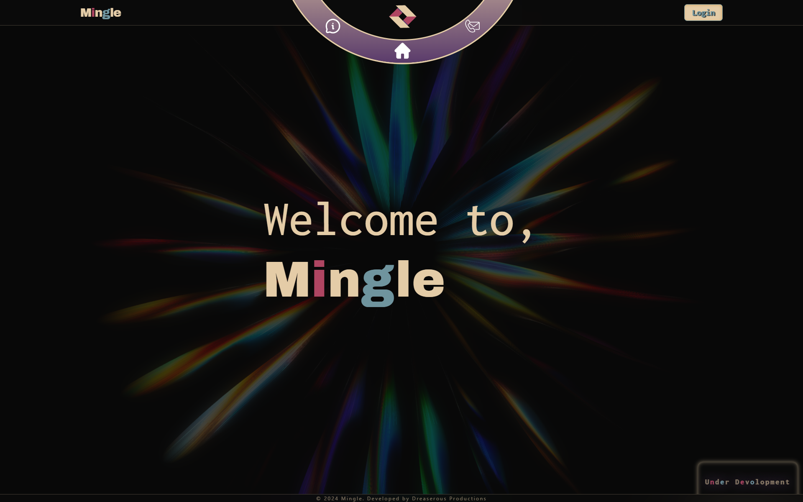
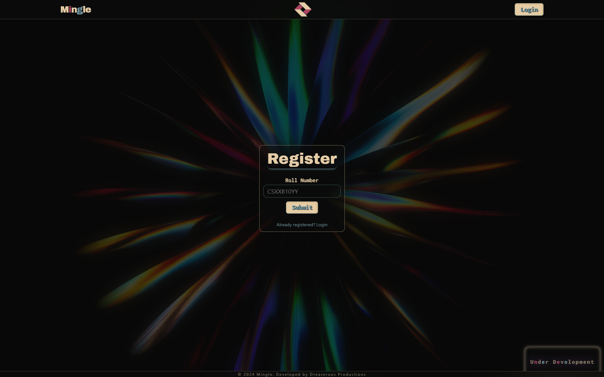
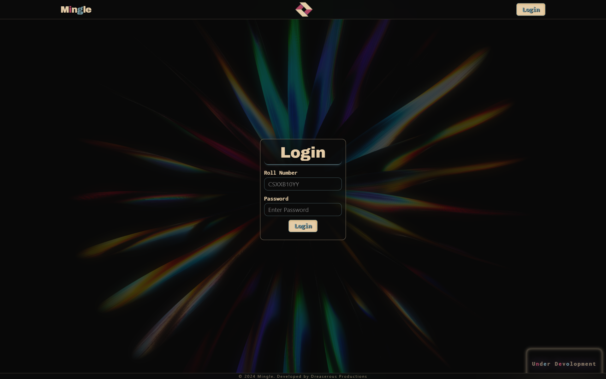
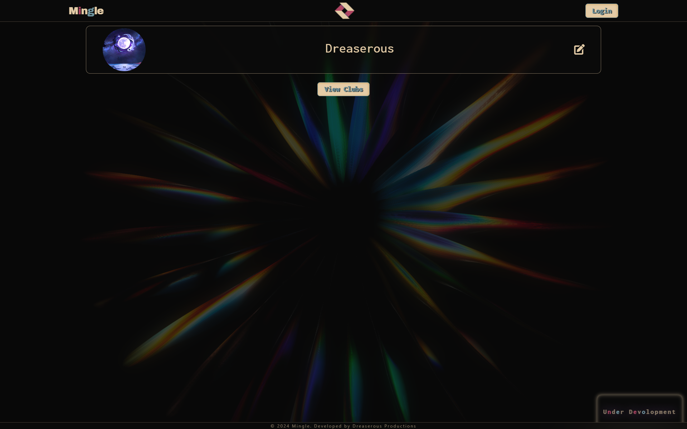
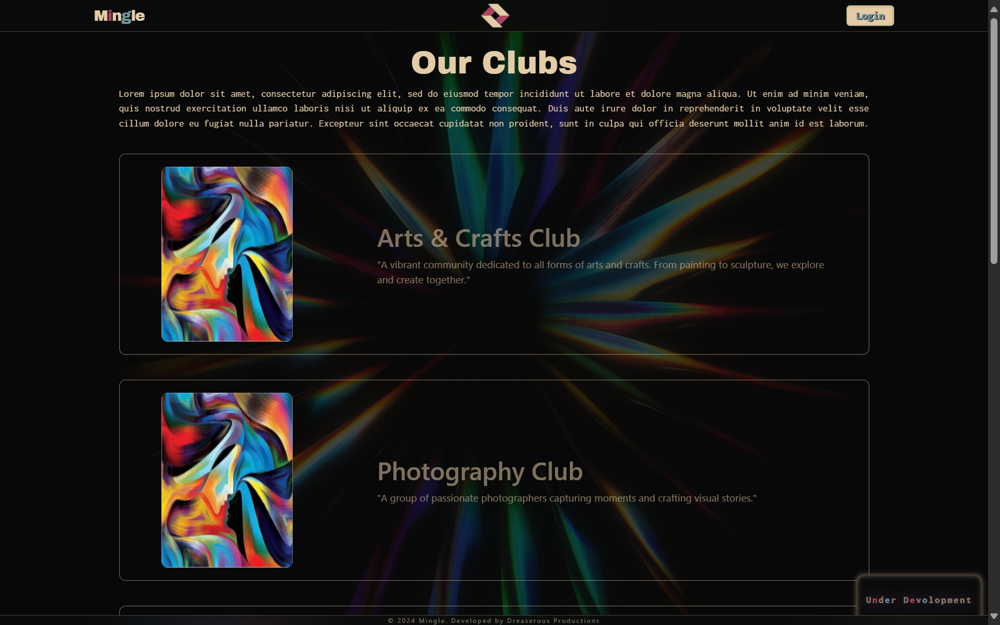
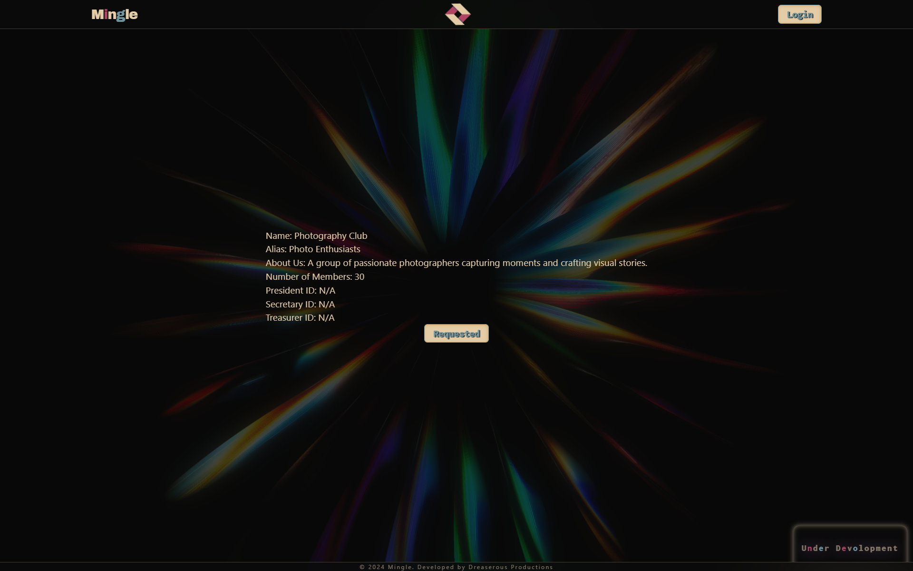
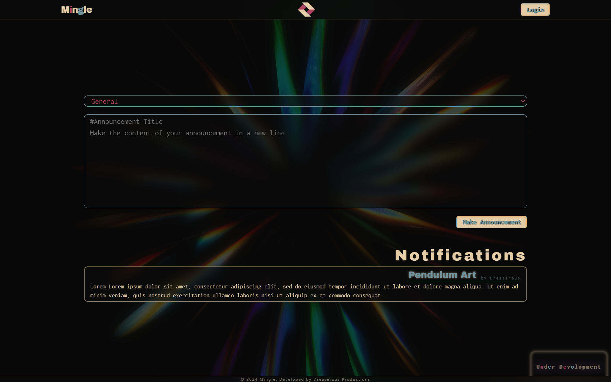
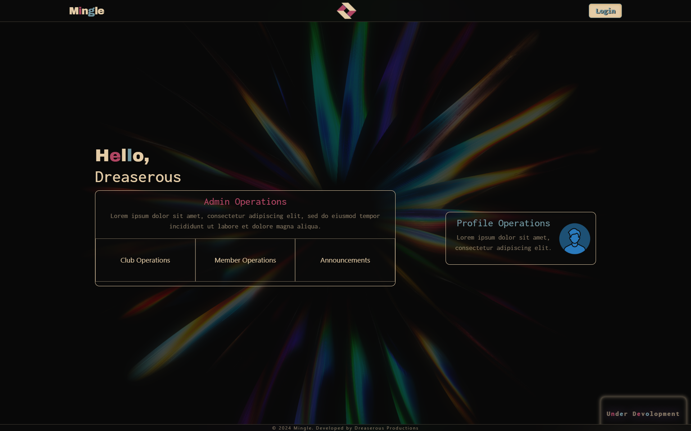
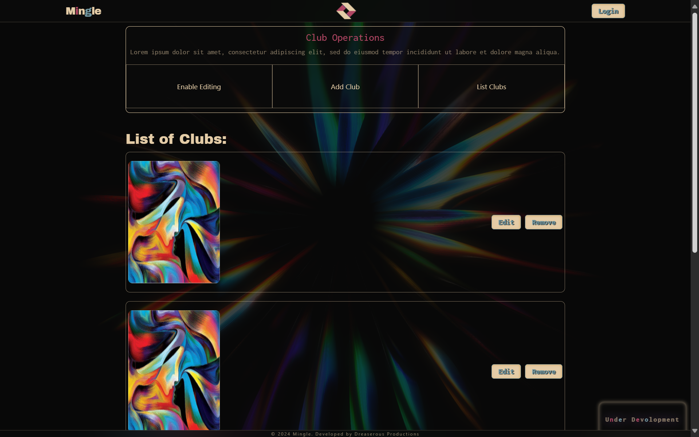
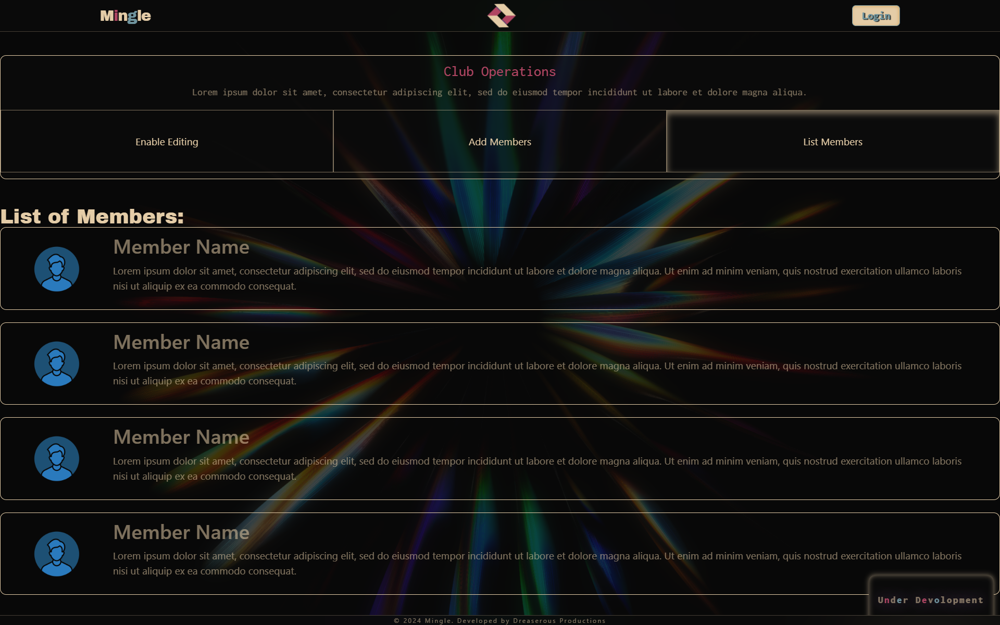

# MINGLE - Club Management System
$${\color{red}Mingle}$$

## Overview

The **Club Management System** is designed to manage various student clubs within a college environment. The system provides functionality for users to register, log in, view clubs, manage members, and perform operations such as joining clubs, editing profiles, and viewing announcements. Admins have access to dashboards for managing club members and making announcements. The project has been built using **Angular** for the front end and **Laravel** for the back end, with **MySQL** for database management.

## Features

### Front-End
- **Home Page**  
  A dynamic home page using **3D models** and **GSAP animations**.

  

- **Circular Menu Activated Navbar**  
  A responsive circular menu-based navigation bar.  

  

- **Registration with OTP Verification**  
  Users can register through their college email, with OTP-based verification.  

  

- **Login with JWT Authentication and Role-Based Security**  
  Login functionality secured with JWT-based role authentication (users/admins).  
  
  

- **User Profile Page**  
  Allows users to view and update their personal details.  

  

- **Club Listing and Detailed Club Page**  
  Displays a list of all clubs and provides the option to request membership.  
  Each club has a detailed page showing member lists and more information. 

  
  
  

- **Announcements Page**  
  Admins can post announcements, and all users can view them.  

  

- **Admin Dashboard**  
  A dashboard for admins to manage clubs, members, and announcements.  

  

- **Admin Club and Member Controls**  
  Admin functionality to manage clubs and members.  

  

  


### Back-End
- **Laravel with MySQL**  
  The back end is built using Laravel, providing full CRUD support for member operations. 
  - **Member operations**: Handles viewing clubs, joining clubs, viewing announcements, logging in, and registering.
  - **Club operations**: Allows admins to manage clubs and members. ❌ (Under Development)
  
  The system uses Laravel's ORM for interacting with the MySQL database.

- **JWT Authentication**  
  Role-based authentication ensures secure access for admins and regular members.

### Git Version Control
The project was developed using Git, with version control managed through regular commits and branches for feature development.

### Deployment
The project is deployed on AWS.  
To view the project, please contact `+91 72000 97169` (WhatsApp) or `naghul.pranav.a.s.4@gmail.com` to request the lab instance to be started. You will be provided a link (Eg: `http:\\100.100.100.100:4200`) to access the site's current version.

## Under Development
- **Mobile Responsiveness**: Improving the layout and design to ensure a seamless experience across various screen sizes and devices.
- **Full HTTPS Integration**: Enhancing security by fully implementing HTTPS protocols to protect user data and secure communication.
- **Single Server Architecture**: Transitioning to a unified Laravel-hosted architecture, eliminating CORS issues by serving both front-end and back-end from the same domain.
- **Admin Control Panel Expansion**: Adding features to the admin dashboard for better management of clubs, members, and system-wide settings.
- **Design Enhancements**: Refining the overall UI/UX with updated visuals, smoother animations, and more intuitive navigation.
- **Code Optimization & Refactoring**: Streamlining code to improve performance, readability, and maintainability, ensuring best coding practices are followed.

## Current Progress

### Front-End Requirements (Angular)
- [x] A responsive user interface that lists all the clubs and their members.
- [ ] Forms to add new clubs and update club details (e.g., name, description, etc.). 
- [ ] Member management functionality including adding new members, editing member information, and removing members from the club. 
- [ ] Search and filter options to easily locate specific members or clubs. 
- [x] A page for viewing detailed information about a club and its members.
- [x] User authentication pages for login and registration.
- [ ] Admin dashboard for managing clubs and their members. 
- [x] Role-based access control to differentiate between regular members and club administrators.

### Back-End Requirements (PHP Framework)
- [x] Develop a RESTful API using Laravel to handle CRUD operations for clubs and member records.
- [ ] Maintainability and readability of code. 
- [x] Secure authentication and session management using industry best practices (e.g., password hashing, secure token generation).
- [x] Implement role-based access control to ensure only authorized users can modify club and member information.
- [x] Validate all user input on both the client-side and server-side to prevent malicious data entry.

### Database Requirements
- [x] Use MySQL for the database.
- [x] Implement ORM (Object-Relational Mapping) for interacting with the database.

### Pages Required
- [x] Login and Registration Pages – for user authentication.
- [x] Club List Page – displays a list of all clubs with options to add, edit, or delete.
- [x] Club Detail Page – shows detailed information about a selected club, including member lists.
- [ ] Member Management Page – for adding, editing, or deleting club members. 
- [ ] Admin Dashboard – for managing overall club operations and users. 
- [x] Profile Page – allows users to view and update their personal information.

### Authentication and Security
- [x] Implement proper user authentication (login and logout) and maintain secure user sessions.
- [x] Ensure all sensitive data is encrypted and protected.
- [x] Utilize secure coding practices to prevent common vulnerabilities such as SQL Injection, Cross-Site Scripting (XSS), and Cross-Site Request Forgery (CSRF).

### Version Control
- [x] Use Git for version control to manage code changes efficiently.
- [x] Ensure regular commits with meaningful messages.

## How to Set Up Locally

### Prerequisites
- Node.js (for Angular)
- Composer (for Laravel)
- MySQL (for database)

### Steps
1. **Clone the Repository**
   ```bash
   git clone <repository-link>
   cd club-management
   ```

2. **Front-End (Angular Setup)**
   ```bash
   cd frontend
   npm install
   ng serve
   ```

3. **Back-End (Laravel Setup)**
   ```bash
   cd backend
   composer install
   cp .env.example .env
   php artisan key:generate
   php artisan migrate
   php artisan serve
   ```

4. **Database Setup**
   - Set up a MySQL database and update `.env` file with your credentials:
     ```
     DB_CONNECTION=mysql
     DB_HOST=127.0.0.1
     DB_PORT=3306
     DB_DATABASE=your_database_name
     DB_USERNAME=your_username
     DB_PASSWORD=your_password
     ```

5. **Access the Application**
   - Frontend: `http://localhost:4200`
   - Backend: `http://localhost:8000`

## Contact
For queries, contact:  
    - `+91 72000 97169` (WhatsApp)  
    - `naghul.pranav.a.s.4@gmail.com`